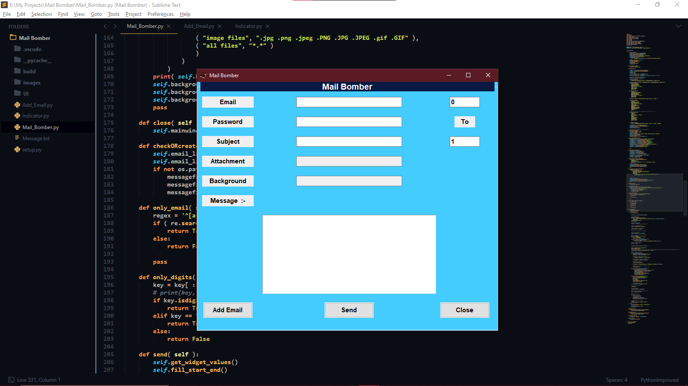
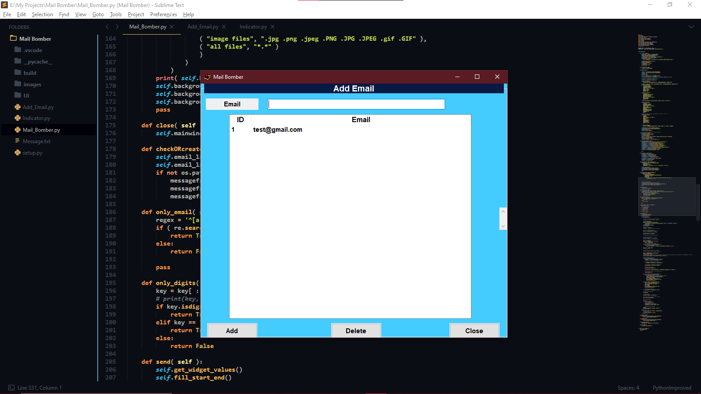

# Mail Bomber
- Send multiple emails at a time
## functionality 
- Add attachments
- Add background image
- Add Signature (By modifying Message.txt)
- Limit number of emails 
## How to Run
- Run following command in terminal
```sh
python Mail_Bomber.py
```
## Snapshots 
- Main Page

- Add Emails

